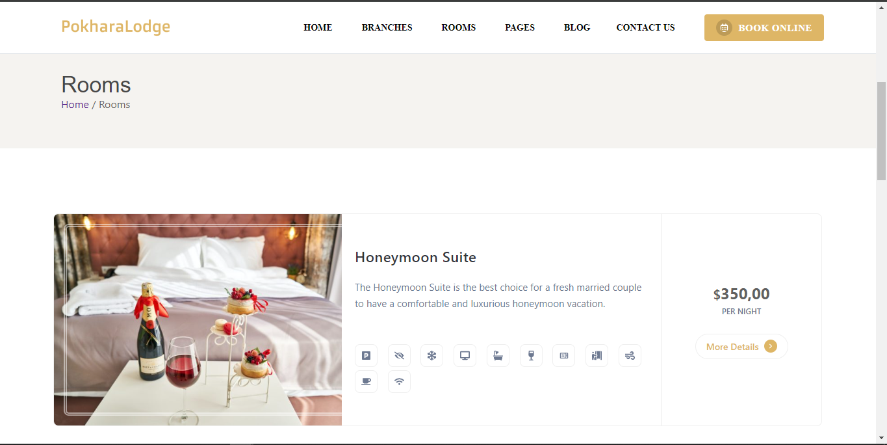
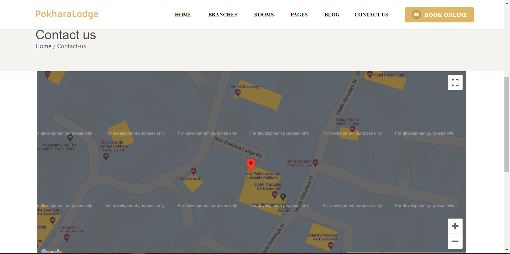

# Mantinev7 Migration Project

<p align="center">
  Welcome to my Mantinev7 migration project! This repository is dedicated to the process of updating a React TypeScript application from older versions of Mantine to the latest version (v7).
</p>

## Introduction

This project serves as a learning and practice ground for migrating a React application that previously utilized older versions of Mantine components to the latest and improved Mantine v7. Explore the migration steps and understand the changes introduced in Mantine v7.

## Features

- **Mantinev7 Components:** Experience the latest Mantine components and their updated features.
- **Migration Steps:** The project documents the step-by-step process of migrating from older Mantine versions to v7.
- **TypeScript Integration:** Leverage TypeScript for type safety during the migration.

## Getting Started

To explore the Mantinev7 migration project, follow these steps:

1. **Clone the repository:**
    ```bash
    git clone https://github.com/soul-xettri/mantinev7-migration.git
    cd mantinev7-migration
    ```

2. **Install dependencies:**
    ```bash
    yarn
    ```

3. **Explore the migration steps and updated Mantine components.**

## Migration Steps

The migration involves the following key steps:

1. **Update Mantine Dependencies:** Replace older versions of Mantine packages with the latest v7 versions.

2. **Adjust Components:** Modify existing components to align with the changes introduced in Mantine v7.

3. **Explore New Features:** Take advantage of new features and improvements available in Mantine v7.

4. **Ensure TypeScript Compatibility:** Address any TypeScript-related issues during the migration.

## Contributing

Contributions are welcome! If you have suggestions for improvement, find bugs, or want to share insights about the Mantine v7 migration process, please submit a pull request or open an issue.

## License

This project is licensed under the MIT License.

Happy learning and migrating to Mantine v7! 🚀

## ScreenShorts 

For a visual representation of the application, refer to the screenshots provided below:

### 1) Header with Mantine V7
<p align="center">
  
  <br />
</p>

### 2) Hero with Mantine V7
<p align="center">
  
  <br />
</p>

### 3) Vertical Carousel with Embla
<p align="center">
  
  *White Mode*
  <br />
 </p>
<p align="center">
  
  *Dark Mode*
  <br />
</p>

### 4) Room Page with SimpleGrid and Grid
<p align="center">
  
  <br />
</p>


### 5) Contact Us with Google Map Api
<p align="center">
  
  <br />
</p>

### 6) Mantine Footer
<p align="center">
  
  *White Mode*
  <br />
 </p>
<p align="center">
  
  *Dark Mode*
  <br />
</p>