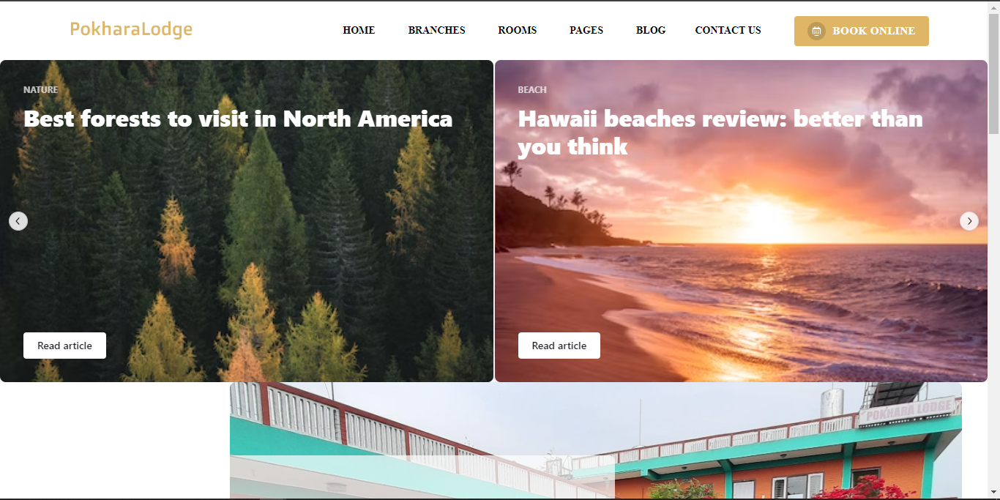
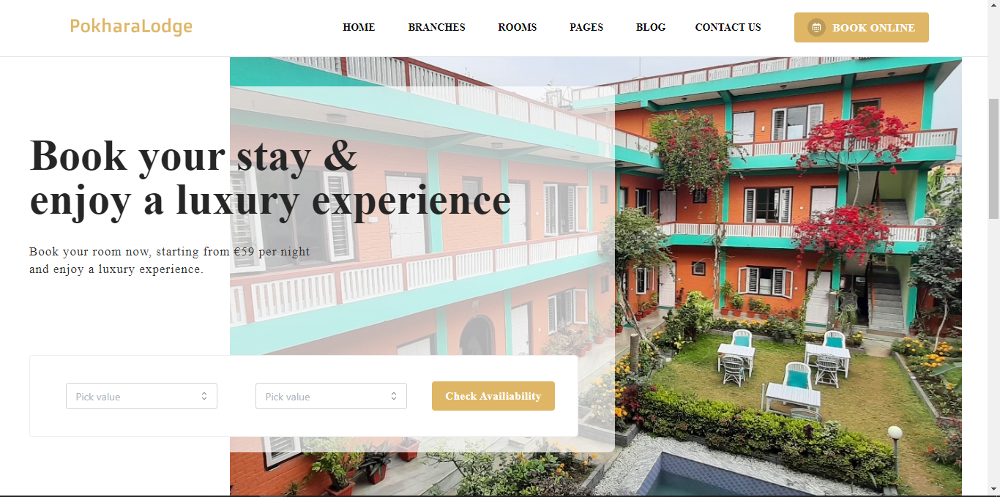
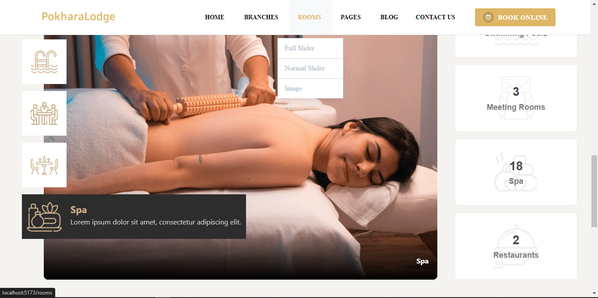
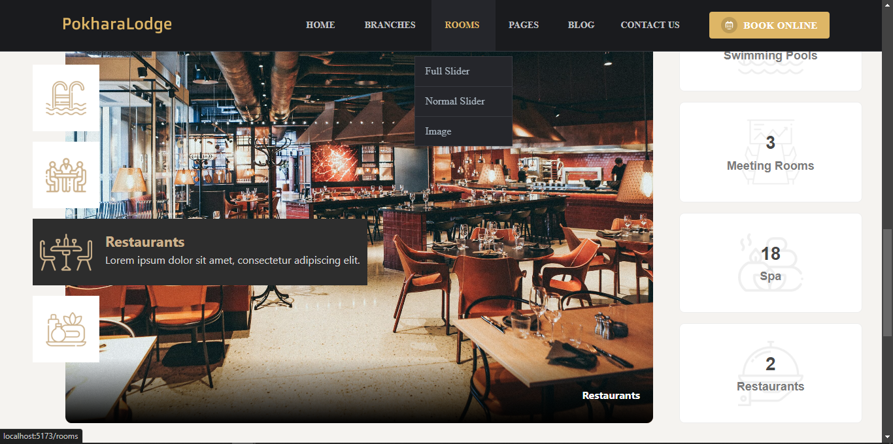
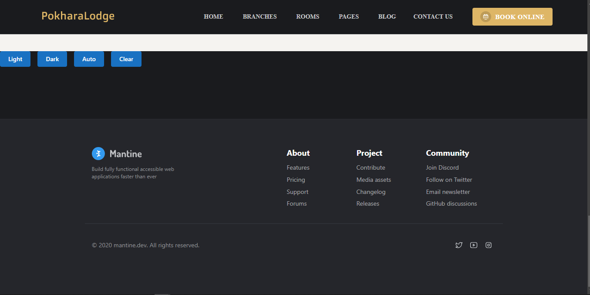
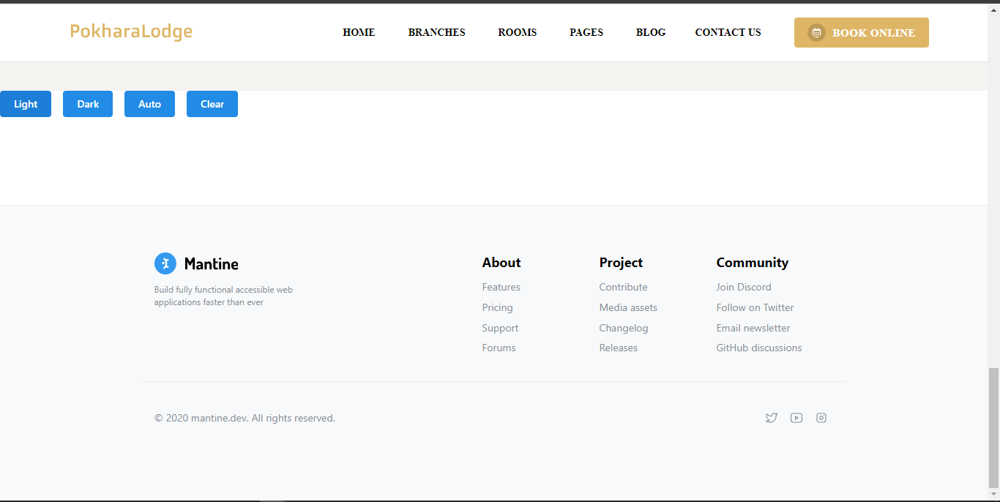

# Mantinev7 React TypeScript App

<p align="center">
  Welcome to my React TypeScript application built with Mantine v7. Explore the latest features and improvements introduced in Mantine version 7.
</p>

## Introduction

This React TypeScript application showcases the capabilities of Mantine v7, a modern React component library designed to simplify web development. Whether you're a seasoned developer or new to React, Mantine provides high-quality components and utilities to enhance your UI.

## Features

- **Component Showcase:** Explore Mantine v7 components with various configurations.
- **Responsive Design:** The application is designed to be responsive and accessible.
- **TypeScript Integration:** Leverage TypeScript for type safety and an improved developer experience.

## Getting Started

To run this React TypeScript application locally, follow these steps:

1. **Clone the repository:**
    ```bash
    git clone https://github.com/soul-xettri/mantinev7.git
    cd mantinev7
    ```

2. **Install dependencies:**
    ```bash
    yarn
    ```

3. **Start the development server:**
    ```bash
    yarn dev
    ```

4. **Open your browser and navigate to [http://localhost:5173](http://localhost:5173) to view the application.**

5. **Explore Mantine v7 components and experiment with different configurations.**

## Functionalities

This application includes the following functionalities:

- **Component Showcase:** Browse through various Mantine v7 components.
- **TypeScript Support:** Utilize TypeScript for enhanced code quality and tooling.
- **Responsive Design:** Experience a responsive layout suitable for different screen sizes.
- **Custom Styling:** Customize the styling of Mantine components to suit your needs.

## Screenshots

For a visual representation of the application, refer to the screenshots provided below:


*Caption for Screenshot 1.*


*Caption for Screenshot 2.*

...

## Contributing

Contributions are welcome! If you have suggestions for improvement, find bugs, or want to add new features, please submit a pull request or open an issue.

## License

This project is licensed under the MIT License.

Happy coding with Mantine v7 in React TypeScript! 🚀

## ScreenShorts 

### 1) Header with Mantine V7
<p align="center">
  
  <br />
</p>

### 2) Hero with Mantine V7
<p align="center">
  
  <br />
</p>

### 3) Vertical Carousel with Embla
<p align="center">
  
  *White Mode*
  <br />
 </p>
<p align="center">
  
  *Dark Mode*
  <br />
</p>

### 4) Room Page with SimpleGrid and Grid
<p align="center">
  
  <br />
</p>


### 5) Contact Us with Google Map Api
<p align="center">
  
  <br />
</p>

### 6) Mantine Footer
<p align="center">
  
  *White Mode*
  <br />
 </p>
<p align="center">
  
  *Dark Mode*
  <br />
</p>